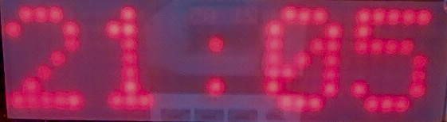

# libledmtx: a library to drive LED dot-matrix displays written in PIC18 assembler

## Introduction
The libledmtx project was developed as a subproject of [p18clock](https://github.com/jalopezg-git/p18clock).
The library is completely written in PIC18 assembler and follows the call convention of the [SDCC](http://sdcc.sourceforge.net/) pic16 port.
Exported routines are meant to be called in by C code.
If you intend to issue calls from assembler, make sure that you follow the [pic16 port](http://sdcc.sourceforge.net/doc/sdccman.pdf) call convention.



## Building libledmtx
Before compiling the library make sure you have this installed:
- [gputils](https://gputils.sourceforge.io/) (the GNU PIC utilities), providing an assembler, librarian, and linker
- GNU make
- GNU gettext-runtime (provides `envsubst`)

To build libledmtx change to the directory where you extracted libledmtx and type
```bash
$ make

# To also compile the included examples
$ cd examples/
$ make
````

## Installing
To install the library files change to the directory where you extracted libledmtx and run `make install` providing the path to the installation directories as in
```bash
$ make LIBDIR=/path/to/lib INCLUDEDIR=/path/to/include BINDIR=/path/to/bin install
```
E.g.,
```bash
$ make LIBDIR=$HOME/libledmtx/lib INCLUDEDIR=$HOME/libledmtx/include BINDIR=$HOME/libledmtx/bin install
```

## Hardware
Refer to docs in the [hardware](https://github.com/jalopezg-git/libledmtx/tree/master/doc/hardware/) directory.
The r393c164 driver requires a `ledmtx_r393c164.inc` configuration file that specifies which I/O port and pins to use for each output signal.
The used I/O port still should be manually configured writing to the `TRISx` / `ADCON1` registers.

## Examples
Some minimal examples are available in the [examples](https://github.com/jalopezg-git/libledmtx/tree/master/examples/) directory.
- [hello32x7](https://github.com/jalopezg-git/libledmtx/blob/master/examples/hello32x7/hello32x7.c), a simple program that prints "hello" using `printf()` (via the `STREAM_USER` stdio stream).
- [scrollstr32x7](https://github.com/jalopezg-git/libledmtx/blob/master/examples/scrollstr32x7/scrollstr32x7.c), that exercises the scrollstr module to asynchronously scroll a long text.

## How does it work?
libledmtx reserves part of the device's RAM as video memory (framebuffer).  The framebuffer is encoded left to right, top to bottom, 1bpp, i.e. each byte holds the value of 8 pixels.
The library has two distinct parts: a set of routines that alter the contents of the framebuffer, and the 'driver', which periodically reads (parts of) the framebuffer and changes the state of the appropriate MCU I/O pins in order to drive the simple video hardware (see [Hardware](https://github.com/jalopezg-git/libledmtx/#hardware)).
The driver is usually activated as part of the libledmtx interrupt service routine (ISR).


libledmtx offers a [core](https://github.com/jalopezg-git/libledmtx/blob/master/include/ledmtx_core.h) set of routines (e.g. `ledmtx_putpixel()`, `ledmtx_setfont()`, or `ledmtx_putchar()`), and a set of modules that can be optionally linked in order to extend the core's capabilities.  Specifically, the following modules are supported:
- `scrollstr`: helper for character string scroll.  Allows automatic scroll of up to 8 strings from the ISR (see [`ledmtx_scrollstr_start()`](https://github.com/jalopezg-git/libledmtx/blob/master/include/ledmtx_scrollstr.h)).
- `perf`: measures time taken to service the libledmtx interrupt.

As of april 2024, there are plans to enable libledmtx to work with multiple buffers, e.g. to implement double buffering.

## Issues / limits
core:
- Maximum framebuffer size:	255x255
- Maximum size of a character:		8x255 (greater than VGA 8x14 is probably useless?)

r393c164 driver:
- High row count most probably looks dimmed, due to multiplexing.

scrollstr module:
- Auto-scroll vector capacity:		8 entries
- Maximum string length:		128 chars (including `\0`)

## Notes on linking against libledmtx
This section provides general guidelines to use and link libledmtx in your project.

1. Copy [`Makefile.template`](https://github.com/jalopezg-git/libledmtx/blob/master/doc/Makefile.template) to you project directory and tune it.
In particular, the value of the `P18FXXX`, `LIBDIR`, `INCLUDEDIR`, `O` and `modules` variables should be set accordingly.
`LIBDIR` and `INCLUDEDIR` should point to the libledmtx install directories.
`O` and `MODULES` list additional libledmtx objects and/or libraries that should be linked.
The `OBJECTS +=` line should list your project object files.

2. Write configuration file for the driver.
For the r393c164 driver, the file `ledmtx_r393c164.inc` (located in your project's directory), should look like this.  The I/O port and pins should be changed to reflect your wiring.
```
  LEDMTX_R393C164_IOPORT	equ	PORTA
  LEDMTX_R393C164_RCLK		equ	RA0
  LEDMTX_R393C164_RRST		equ	RA1
  LEDMTX_R393C164_RENA		equ	RA2
  LEDMTX_R393C164_CCLK		equ	RA3
  LEDMTX_R393C164_CDAT		equ	RA4
```

3. The `LEDMTX_BEGIN_MODULES_INIT` / `LEDMTX_END_MODULES_INIT` section is mandatory even if you are not using any module.
Header files for any module should be `#include`d before `ledmtx_core.h`.
A framebuffer (i.e., a small data memory area that stores the current frame) should be declared as follows:
```c
  LEDMTX_FRAMEBUFFER_RES(size)
```
where $size = height * ceil(width / 8)$.

4. If you are using TMR0 interrupts to call the driver-specific routine for vertical refresh, you should also include the following code:
```c
  DEF_INTLOW(low_int)
  DEF_HANDLER(SIG_TMR0, _tmr0_handler)
  END_DEF

  SIGHANDLERNAKED(_tmr0_handler)
  {
    LEDMTX_BEGIN_ISR
    LEDMTX_VERTREFRESH
    LEDMTX_END_ISR
  }
```

5. `ledmtx_init()` should be called on initialisation.  If you intend to use Timer0 to drive the display, you should compute proper values for the `TMR0H`, `TMR0L` and `T0CON` registers.
The `ledmtx_tmr0config` tool included in the [support/](https://github.com/jalopezg-git/libledmtx/tree/master/support/) directory automates this task.
Example:
```c
  // Initialize libledmtx for a 32x7 @ 50Hz display (assuming Fosc == 8MHz)
  // The last three arguments were computed by `$ ledmtx_tmr0config 7 50 8000000`
  ledmtx_init(LEDMTX_INIT_CLEAR | LEDMTX_INIT_TMR0, 32, 7, 0xe9, 0xae, 0x88)
```

## Contributing
Contributions either in the form of new features / fixes, hardware improvements, or documentation are welcome :+1:.
Feel free to open a pull request if you have something to say!
